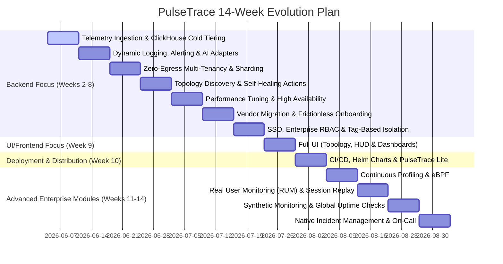

# PulseTrace: 14-Week Enterprise-Grade Observability Roadmap

This roadmap details the step-by-step path to evolve PulseTrace into a production-ready observability platform. 

## 💡 Core Unique Value Propositions (UVPs)
To challenge market leaders like Datadog, New Relic, and Dynatrace, we compete purely on **Cost, Privacy, and Frictionless Adoption**:

1. **90% Cheaper than Datadog (Automated Cost Control):** Keeping petabytes of data on hot SSDs is how giants overcharge. PulseTrace uses **S3 Cold Tiering** for infinite cheap retention. Furthermore, our **AI Log Leveling** defaults to dropping debug logs, but instantly commands agents to stream full `DEBUG` logs only when latency/errors spike, drastically cutting ingestion bills.
2. **Zero-Code "Trojan Horse" Migration:** You don't have to rip out Datadog or Splunk agents. Simply change the ingestion URL in your existing agents to point to PulseTrace. We spoof competitor endpoints (via OTLP) for an instant, zero-code migration.
3. **Zero-Egress Security (The Hybrid Cloud Advantage):** Raw logs stay on your on-premise/VPC infrastructure. Only metadata is sent to our SaaS control plane. This eliminates millions in AWS/GCP egress fees and solves data-privacy compliance instantly.

---

## Roadmap Overview

---

## Detailed Weekly Roadmap

### Week 1: Core Foundation & Causal AI (Completed)
*   **Target:** Establish distributed microservices architecture, trace context propagation, and basic AI-driven correlation.
*   **Key Deliverables:**
    *   Setup gateway, log, alert, and correlation Go services.
    *   Configure Kafka streams for logs and alerts; RabbitMQ for notifications.
    *   Integrate OpenTelemetry distributed tracing (Jaeger integration).
    *   Implement deterministic incident grouping and local LangChain LLM causal analysis.

---

### Week 2: ClickHouse Telemetry Storage & Multi-Cloud Cold Storage Tiering (Completed)
*   **Target:** Integrate ClickHouse for structured log analytics and metrics, enabling ingestion speeds matching enterprise scales while offering hyper-cheap archival.
*   **Key Deliverables:**
    *   Deploy ClickHouse clusters for high-volume structured log and metric storage, utilizing MergeTree engines for sub-second queries.
    *   Configure Go consumers using batching algorithms to insert up to 10,000 logs in single ClickHouse transactional batches to maximize throughput.
    *   Implement ClickHouse storage tiering policies. *Hot data* stays on local SSD/NVMe drives; *Cold data* is compressed and archived directly to S3/MinIO.
    *   Implement direct OTLP/gRPC and OTLP/HTTP ingestion endpoints in `gateway-service`.

---

### Week 3: Pluggable AI Adapters & Dynamic Log Detail Leveling (Completed)
*   **Target:** Deploy advanced alerting, multi-window SLO budget tracking, pluggable LLMs, and real-time ingestion volume controls.
*   **Key Deliverables:**
    *   Refactor the causal analyzer to support pluggable adapters: local LLM (LangChain Go), OpenAI (GPT-4o), Google Gemini API (Gemini 1.5 Pro), and Anthropic Claude (Claude 3.5 Sonnet).
    *   Create agent feedback endpoints to command agents to toggle "Debug Mode" automatically for cost savings.
    *   Implement multi-window multi-threshold budget alerts for availability and latency SLO targets.

---

### Week 4: Zero-Egress Hybrid Architecture & Enterprise Sharding (Completed)
*   **Target:** Implement a hyper-scale tenant isolation model built to support massive tech giants with on-premise security.
*   **Key Deliverables:**
    *   Allow raw telemetry and databases (ClickHouse) to remain securely on-premise inside the customer's cloud network to eliminate network egress fees.
    *   Implement a hybrid multi-tenancy model using `tenant_id` as the distribution/partition key for shard routing.
    *   Write high-performance regex parsing routines in Go to mask sensitive credentials and PII at the ingestion gateway.

---

### Week 5: Auto-Topology Discovery & AI Self-Healing Playbooks (Completed)
*   **Target:** Enable automated service dependency map creation, optimize graph database queries, and automate recovery playbooks.
*   **Key Deliverables:**
    *   Extract relationship links directly from OpenTelemetry span parent/child interactions.
    *   Connect the AI root cause engine to an automation router for automatic recovery playbook execution (e.g., Kubernetes rolling restart).
    *   Implement a Redis cache layer for graph topology to reduce Neo4j lookup times during critical RCA loops.

---

### Week 6: Performance Profiling, Optimization & Load Testing (Completed)
*   **Target:** Scale the Go backend services to handle high traffic loads with minimal resources.
*   **Key Deliverables:**
    *   Audit memory allocations, using `sync.Pool` for JSON encoders/decoders to minimize Garbage Collector overhead.
    *   Run scale tests using `k6` or `Locust` to verify the system handles 10,000+ incoming requests/sec.
    *   Configure Active-Active replica clusters for RabbitMQ and setup Postgres Read-Replicas.

---

### Week 7: Quickwit Architecture Pivot, Vendor Migration & UI Foundation
*   **Target:** Pivot to native S3 log indexing, create a zero-code migration path for Datadog/Splunk customers, and scaffold the UI.
*   **Key Deliverables:**
    *   **Backend (Quickwit Pivot):** Replace ClickHouse with **Quickwit** for sub-second, true S3-native log and trace indexing. Delete custom Kafka consumer code and use Quickwit's native Kafka ingest. 
    *   **Backend (Cost & Migration):** Configure OTel Collector for **"Trojan Horse" Ingestion** (accepting Datadog/Splunk payloads directly). Implement **Tail-Based Trace Sampling** in the OTel Collector (dropping 99% of successful traces to save costs). Create the 1-Line Bootstrap shell scripts.
    *   **Frontend (UI):** Scaffold the **Next.js** application and **Unified Design System** (Tailwind/Shadcn). Build the **Frictionless Onboarding Wizard** and API Key generation screens.

---

### Week 8: Single Sign-On (SSO), RBAC & Service Catalog UI
*   **Target:** Establish enterprise identity delegation, RBAC, and core telemetry views.
*   **Key Deliverables:**
    *   **Backend:** Integrate SSO (SAML/OIDC). Implement dynamic RBAC APIs, ABAC Tag-based constraints, and distributed rate limiting.
    *   **Frontend (UI):** Build the **Telemetry Explorer** using Virtualized Lists. Include **Live Tail / Live Search** (viewing 100% of un-sampled real-time traces) and **Faceted App Analytics** (Datadog APM parity). Build the **Service Catalog & Ownership Dashboard** (mapping teams, Slack channels, and GitHub repos to microservices). Build the **Settings & Role Management Dashboard**.

---

### Week 9: Advanced UI — Topology, Flame Graphs & Pulse AI
*   **Target:** Build premium visualization panels and deploy the Pulse AI Autonomous Agents.
*   **Key Deliverables:**
    *   **Interactive React Flow Graph:** Build the dynamic system graph showing service nodes (colored by health status) and edges to visually highlight failure propagation paths.
    *   **Trace Flame Graph Viewer:** Build a Gantt-chart style visualization for deep-dive debugging of individual distributed traces (span-by-span latency analysis).
    *   **Deployment Tracking & DBM:** Add UI panels for version-to-version release comparisons and Database Monitoring (slow query analytics).
    *   **Pulse AI Chat Widget (UI):** Build the conversational interface for Text-to-SQL querying directly in the dashboard.
    *   **Pulse AI Auto-Fix (Backend):** Upgrade the `correlation-service` to trigger automated GitHub Pull Requests when stack traces are detected.

---

### Week 10: Developer Experience & Enterprise Packaging
*   **Target:** Create a production-ready deployment package and build the ultimate developer workflow tools.
*   **Key Deliverables:**
    *   **Backend:** Develop Helm charts for Kubernetes deployments. Build robust CI/CD pipelines via GitHub Actions.
    *   **Frontend (UI):** Build the **Tenant & Cost Dashboards**. Add the **Outlier Explorer** (Honeycomb "BubbleUp" parity) and **Watchdog-Style Anomaly Highlights** to instantly highlight anomalous dimensions. Build the **Grouped Error Tracking Dashboard** (Datadog/Sentry parity) to track high-frequency exceptions. Perform final UI polish and animation passes.
    *   **IDE Extension:** Build the **PulseTrace VS Code Extension** (New Relic CodeStream parity) to bring stack traces and active incidents directly into the developer's editor.

---

### Week 11: Continuous Profiling & eBPF Auto-Instrumentation
*   **Target:** Provide zero-instrumentation profiling and deep infrastructure visibility to rival Datadog's continuous profiler.
*   **Key Deliverables:**
    *   **Backend:** Deploy eBPF daemonsets for continuous CPU/Memory profiling and Network Performance Monitoring (NPM).
    *   **Frontend (UI):** Build the Flamegraph UI for continuous profiling visualization.

---

### Week 12: Real User Monitoring (RUM) & Session Replay
*   **Target:** Capture frontend performance metrics and user sessions to provide full end-to-end visibility.
*   **Key Deliverables:**
    *   **SDK:** Create a lightweight JS SDK for capturing Core Web Vitals, frontend errors, and DOM mutations.
    *   **Frontend (UI):** Build the Session Replay video player and frontend error tracking dashboard.

---

### Week 13: Synthetic Monitoring & Global Uptime Checks
*   **Target:** Proactively monitor API endpoints and critical user journeys from global locations.
*   **Key Deliverables:**
    *   **Backend:** Build geo-distributed runners to execute API pings and simulate browser flows (using Puppeteer/Playwright).
    *   **Frontend (UI):** Add multi-step API assertions and uptime dashboards.

---

### Week 14: Native Incident Management & On-Call (PagerDuty Parity)
*   **Target:** Eliminate the need for expensive third-party tools like PagerDuty by providing built-in on-call scheduling and escalations.
*   **Key Deliverables:**
    *   **Backend:** Implement Escalation Policies, On-Call Schedules, and integrate with Twilio for SMS/Voice alerts.
    *   **Frontend (UI):** Build the Incident Command Center UI for managing active incidents and responder coordination.

