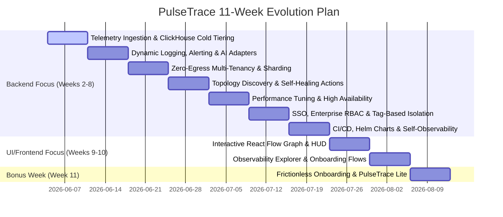

# PulseTrace: 11-Week Enterprise-Grade Observability Roadmap

This roadmap details the step-by-step path to evolve PulseTrace from its current foundation into a production-ready, highly scalable, secure, and maintainable observability platform. The goals are tailored to challenge market leaders like Datadog, New Relic, and Dynatrace by prioritizing **privacy (local Causal AI)**, **cost-efficiency**, and **frictionless migration**.

---

## Roadmap Overview

---

## Detailed Weekly Roadmap

### Week 1: Core Foundation & Causal AI (Completed)
*   **Target:** Establish distributed microservices architecture, trace context propagation, and basic AI-driven correlation.
*   **Key Deliverables:**
    *   Setup gateway, log, alert, and correlation Go services.
    *   Configure Kafka streams for logs and alerts; RabbitMQ for notifications.
    *   Integrate OpenTelemetry distributed tracing (Jaeger integration).
    *   Implement deterministic incident grouping and local LangChain LLM causal analysis.

---

### Week 2: ClickHouse Telemetry Storage & Multi-Cloud Cold Storage Tiering
*   **Target:** Integrate ClickHouse for structured log analytics and metrics, enabling ingestion speeds matching enterprise scales while offering hyper-cheap archival.
*   **Key Deliverables:**
    *   **ClickHouse Integration:** Deploy ClickHouse clusters for high-volume structured log and metric storage, utilizing MergeTree engines for sub-second queries.
    *   **Kafka Batch Ingestion:** Configure Go consumers using batching algorithms to insert up to 10,000 logs in single ClickHouse transactional batches to maximize throughput.
    *   **Multi-Cloud Cold Storage Tiering (USP):** Implement ClickHouse storage tiering policies. *Hot data* stays on local SSD/NVMe drives; *Cold data* is compressed and archived directly to the client's choice of object storage: AWS S3, Google Cloud Storage (GCS), Azure Blob Storage, or on-premise private object stores (MinIO/Ceph).
    *   **Native OTLP Receivers:** Implement direct OTLP/gRPC and OTLP/HTTP ingestion endpoints in `gateway-service` for seamless client-agent migration.

---

### Week 3: Pluggable AI Adapters & Dynamic Log Detail Leveling (The Cost Killer)
*   **Target:** Deploy advanced alerting, multi-window SLO budget tracking, pluggable LLMs, and real-time ingestion volume controls.
*   **Key Deliverables:**
    *   **Multi-Provider AI Adapters:** Refactor the causal analyzer to support pluggable adapters: local LLM (LangChain Go), OpenAI (GPT-4o), Google Gemini API (Gemini 1.5 Pro), and Anthropic Claude (Claude 3.5 Sonnet).
    *   **Dynamic Log Detail Leveling (USP):** Create agent feedback endpoints. By default, agents send only high-level metrics and `WARN`/`ERROR` logs. If the correlation engine detects a warning or SLO burn rate anomaly, it automatically commands agents to toggle "Debug Mode" (streaming full `DEBUG` logs and 100% trace sampling) for the affected systems.
    *   **Burn Rate Alerting:** Implement multi-window multi-threshold budget alerts for availability and latency SLO targets.

---

### Week 4: Zero-Egress Hybrid Architecture & Enterprise Sharding
*   **Target:** Implement a hyper-scale tenant isolation model built to support massive tech giants (similar to Netflix, Uber, or Akamai) with on-premise security.
*   **Key Deliverables:**
    *   **Zero-Data-Egress Architecture (USP):** Allow raw telemetry and databases (ClickHouse) to remain securely on-premise inside the customer's cloud network. The central SaaS control plane only receives anonymized metadata, alerts, and incident state graphs, eliminating network egress fees and compliance risks.
    *   **ClickHouse Cluster Sharding:** Implement a hybrid multi-tenancy model using `tenant_id` as the distribution/partition key. Enable automatic dynamic routing of high-tier enterprise clients to dedicated physical database shards.
    *   **PII Sanitizer Pipeline:** Write high-performance regex parsing routines in Go to mask sensitive credentials and PII (card details, tokens, credentials) at the ingestion gateway before queuing to Kafka.

---

### Week 5: Auto-Topology Discovery & AI Self-Healing Playbooks
*   **Target:** Enable automated service dependency map creation, optimize graph database queries, and automate recovery playbooks.
*   **Key Deliverables:**
    *   **Span-Based Topology Discovery:** Extract relationship links directly from OpenTelemetry span parent/child interactions (e.g., tracing a call from `gateway` to `payment-service` automatically upserts dependencies).
    *   **AI Self-Healing Actions & Runbook Execution (USP):** Connect the AI root cause engine to an automation router. When the AI model validates an incident's root cause (e.g., *"Kubernetes pod memory leak"*), it suggests or automatically executes a signed recovery playbook (e.g., Kubernetes rolling restart or database pool recycle) via secure agent handlers.
    *   **Neo4j Graph Caching:** Implement a Redis cache layer for graph topology to reduce Neo4j lookup times during critical RCA loops.

---

### Week 6: Performance Profiling, Optimization & Load Testing
*   **Target:** Scale the Go backend services to handle high traffic loads with minimal resources.
*   **Key Deliverables:**
    *   **Memory Profiling (`pprof`):** Audit memory allocations, using `sync.Pool` for JSON encoders/decoders to minimize Garbage Collector overhead.
    *   **High-Volume Benchmarking:** Run scale tests using `k6` or `Locust` to verify the system handles 10,000+ incoming requests/sec.
    *   **Clustering & Fault Tolerance:** Configure Active-Active replica clusters for RabbitMQ and setup Postgres Read-Replicas.

---

### Week 7: Single Sign-On (SSO), Enterprise RBAC & Tag-Based Isolation
*   **Target:** Establish enterprise identity delegation, dynamic custom role creation, and metadata tag restrictions.
*   **Key Deliverables:**
    *   **SSO Integration (SAML 2.0 / OIDC):** Integrate standard identity federation protocols inside `gateway-service` to authorize login requests via Okta, Entra ID (Azure), Google Workspace, or Ping Identity.
    *   **Granular Custom Roles & Permissions:** Design dynamic role configuration APIs. Administrators can create, read, update, and delete roles mapping to specific capability scopes (e.g., `telemetry:read`, `slo:write`, `runbook:execute`, `billing:manage`).
    *   **Tag-Based Security Constraints (ABAC/Row-Level Security):** Implement metadata filters on telemetry searches. Users belonging to restricted roles are bound by resource tags (e.g., a role restricted with `env: staging` or `team: payment` can only execute ClickHouse queries that include those filter parameters, isolating databases between sensitive departments).
    *   **Distributed Rate Limiting:** Implement sliding window rate limiters using Redis at the `gateway-service` level, configurable per tenant.
    *   **Microservices mTLS:** Secure all service-to-service communication paths using Mutual TLS certificates.
    *   **Audit Logging:** Implement immutable audit logging for administrative actions (like modifying SLO thresholds or deleting users).

---

### Week 8: CI/CD, Containerization & Production Packaging
*   **Target:** Package PulseTrace for easy, automated deployments to multi-cloud Kubernetes environments.
*   **Key Deliverables:**
    *   **Kubernetes Helm Charts:** Develop production-ready Helm charts to deploy PulseTrace on Amazon EKS, Google GKE, or Azure AKS.
    *   **Self-Observability Pipeline:** Set up PulseTrace to monitor itself. Expose `/metrics` endpoints across all Go services for Prometheus scraping.
    *   **Zero-Downtime CI/CD:** Build GitHub Actions pipelines to build, lint, test, and release Docker images using distroless base images.

---

### Week 9: UI Part 1 — Interactive Dependency Graph & Incident HUD
*   **Target:** Build a premium, high-density visualization panel for topology graphs and active incidents.
*   **Key Deliverables:**
    *   **React Flow Topology Graph:** Build the dynamic system graph showing nodes (colored by real-time health status) and edges. Highlight failure propagation paths visually.
    *   **Incident Command Center:** Design the HUD displaying active incidents, impact levels, and real-time alerts.
    *   **Root Cause Modal:** Develop the visual diagnostic screen displaying the AI-generated natural language summary and troubleshooting checklists.

---

### Week 10: UI Part 2 — Observability Explorer & Onboarding Flows
*   **Target:** Complete logs/traces query explorers, SLO dashboards, and frictionless onboarding screens.
*   **Key Deliverables:**
    *   **Telemetry Explorer:** Create a high-density, searchable table for logs and traces. Allow users to filter by tags, severity, and service names, and click a log to jump to its distributed trace graph.
    *   **SLO Configurator:** Build a wizard to add, edit, and delete SLO targets, displaying error budget depletion trendlines.
    *   **Onboarding Checklist:** Build a walkthrough interface that provides API keys and config snippets to help new customers connect their applications in under 5 minutes.

---

### Bonus Week (Week 11): Frictionless Onboarding & PulseTrace Lite
*   **Target:** Make the product instantly adoptable for teams of all sizes, from indie developers to enterprise trials.
*   **Key Deliverables:**
    *   **`pulsetrace-lite` Single-Binary Target:** Build a compilation configuration utilizing Go build tags (e.g., `-tags lite`) to bundle all services into a single self-contained binary. Relational data is backed by embedded **SQLite**, telemetry is backed by embedded **DuckDB**, and message passing uses in-memory queues, dropping external dependencies (Kafka, RabbitMQ, Neo4j, ClickHouse) for small environments.
    *   **Interactive Shell Bootstrap Script:** Create a simple install shell script (`curl -sfL https://pulsetrace.sh/install.sh | sh`) for one-line installation and spin-up.
    *   **SaaS Gateway Agent Registration:** Build automated provisioning routines in `gateway-service` that generate customized configuration yaml templates for new users in one click.
