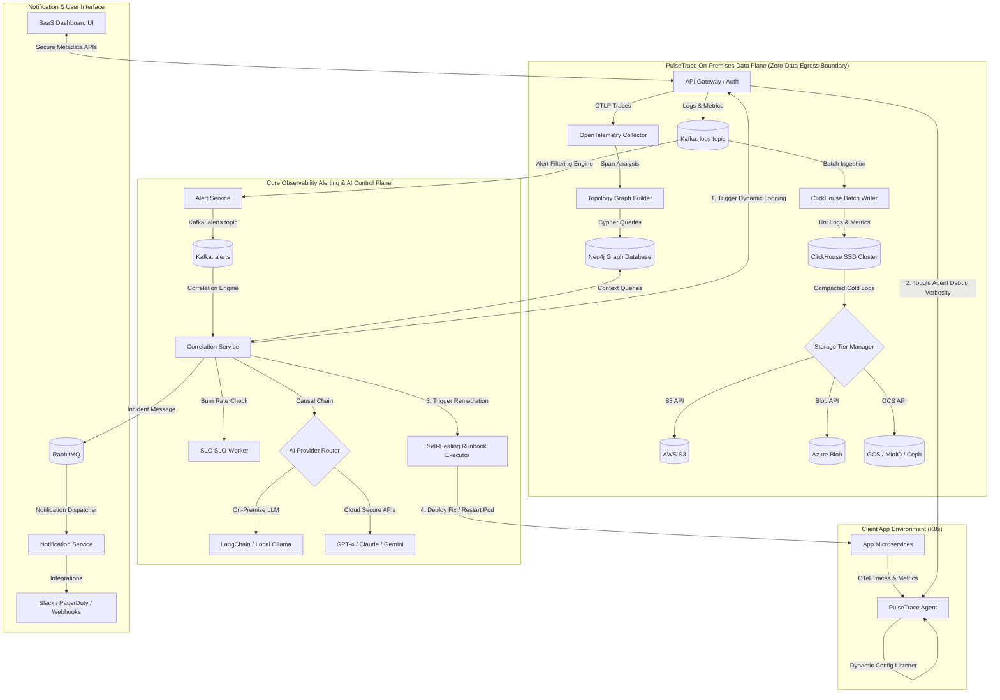

# PulseTrace: Final Product System Architecture

This document outlines the final production-ready system architecture of PulseTrace, illustrating telemetry ingestion pipelines, the zero-data-egress compliance boundaries, hybrid multi-cloud storage tiering, causal AI diagnostics, and self-healing playbooks.

---

## 1. High-Level Data & Control Plane

The diagram below displays the end-to-end flow of telemetry data, feedback loops for dynamic logging, and the partition between the local client environment (Zero-Data-Egress boundary) and the control plane.

---

## 2. Core Architectural Subsystems

### A. Telemetry Storage Pipeline (ClickHouse Multi-Cloud Storage Tiering)
To achieve Datadog-grade querying at a fraction of the cost, PulseTrace implements a hybrid multi-cloud cold storage strategy:
1.  **Ingestion:** The Batch Writer collects Go struct representations of OTel payloads and commits them to ClickHouse using multi-threaded block writes (buffers of 10,000 items or 100ms timeouts).
2.  **Hot Tier:** The last 7 days of logs, traces, and metrics are written directly to fast local storage (NVMe/SSD) for active incident investigation.
3.  **Cold Tier:** ClickHouse's tiered storage manager automatically compresses data (typically achieving 5x–10x compression ratios) and pushes it to object stores (Amazon S3, Azure Blob, Google GCS, or private MinIO instances). Active queries seamlessly traverse both storage tiers without manual intervention.

---

### B. Dynamic Logging & Anomaly Feedback Loops
Instead of constantly paying for the ingestion of verbose trace data and debug logs:
1.  Agents run in **Minimal Mode**, collecting high-level system metrics and error logs.
2.  The **SLO Burn Rate Worker** and **Anomaly Detector** continuously evaluate system thresholds.
3.  Upon detecting an anomaly, a socket backchannel command is sent through the Gateway to the local agents on the affected microservices.
4.  The agents dynamically elevate the logging level to `DEBUG` and set tracing sampling to `100%` for specific API routes. Once the system health returns to normal, the system drops back to Minimal Mode.

---

### C. Root Cause Analysis (RCA) & AI Remediation
1.  **Topology Discovery:** The Topology Service automatically builds service maps in Neo4j by tracing parent-child calls from OpenTelemetry spans.
2.  **Causal Analysis:** When alerts fire, the Correlation Service queries Neo4j to build a failure propagation path (e.g., *Frontend* $\rightarrow$ *Orders-Service* $\rightarrow$ *Database*).
3.  **Narrative & Self-Healing:** The pluggable AI router sends this causal chain to the configured LLM. The model creates a natural-language description and identifies the remedy. The Runbook Executor runs automated restoration actions (like cycling connections or restarting crashed pods) to minimize MTTR (Mean Time to Resolution).
